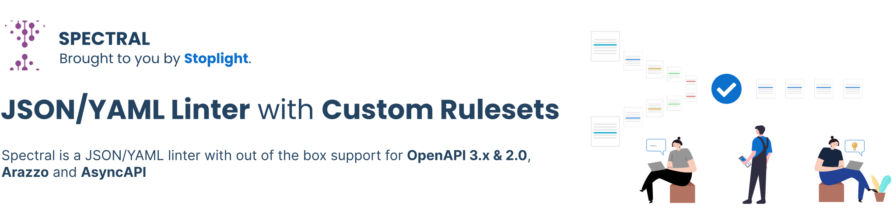

[](https://stoplight.io/api-governance?utm_source=github&utm_medium=spectral&utm_campaign=readme)
[](https://circleci.com/gh/stoplightio/spectral) [](https://www.npmjs.com/package/@stoplight/spectral) [][stoplight_forest]

- **Custom Rulesets**: Create custom rules to lint JSON or YAML objects
- **Ready-to-use Rulesets**: Validate and lint **OpenAPI v2 & v3.x** and **AsyncAPI** Documents
- **API Style Guides**: Automated API Style Guides using rulesets improve consistency across all your APIs
- **Ready-to-use Functions**: Built-in set of functions to help [create custom rules](https://meta.stoplight.io/docs/spectral/e5b9616d6d50c-custom-rulesets#adding-rules). Functions include pattern checks, parameter checks, alphabetical ordering, a specified number of characters, provided keys are present in an object, etc.
- **Custom Functions**: Create custom functions for advanced use cases

# Overview

- [Installation and Usage](#-installation-and-Usage)
- [Documentation](#-documentation)
- [Support](#-support)
- [FAQs](#-faqs)
- [Contributing](#-contributing)

## 🧰 Installation and Usage

**Install**

```bash
npm install -g @stoplight/spectral-cli

# OR

yarn global add @stoplight/spectral-cli
```

Find more [installation methods](https://meta.stoplight.io/docs/spectral/ZG9jOjYyMDc0Mw-installation) in our documentation.

**Create a local rRuleset**

Spectral, being a generic YAML/JSON linter, needs a ruleset to lint files. There are two ways to get a ruleset:

1. Run this command to get our predefined rulesets based on OpenAPI or AsyncAPI:

```bash
echo 'extends: ["spectral:oas", "spectral:asyncapi"]' > .spectral.yaml
```

1. Create your [own ruleset](https://meta.stoplight.io/docs/spectral/01baf06bdd05a-rulesets)

**Lint**

Use this command if you have defined the ruleset in the the same directory as the documents you are linting:

```bash
spectral lint myapifile.yaml
```

Use this command to lint with a custom ruleset, or one that is located in a different directory than the documents being linted:

```bash
spectral lint myapifile.yaml --ruleset myruleset.yaml
```

## 📖 Documentation

- [Documentation](https://meta.stoplight.io/docs/spectral/docs/getting-started/1-concepts.md)
  - [Getting Started](https://meta.stoplight.io/docs/spectral/docs/getting-started/1-concepts.md) - The basics of Spectral.
  - [Rulesets](https://meta.stoplight.io/docs/spectral/01baf06bdd05a-rulesets) - Understand the structure of a ruleset so you can tweak and make your own rules.

Once you've had a look through some of the getting started material, some of our guides might help you become a power user.

- [Different Workflows](https://meta.stoplight.io/docs/spectral/docs/guides/1-workflows.md) - When and where should you use Spectral? Editors, Git-hooks, Continuous Integration, GitHub Actions, wherever you like!
- [Using the command-line interface](https://meta.stoplight.io/docs/spectral/docs/guides/2-cli.md) - Quickest way to get going with Spectral is in the CLI.
- [Using the JavaScript API](https://meta.stoplight.io/docs/spectral/docs/guides/3-javascript.md) - Access the _raw power_ of Spectral via the JS, or hey, TypeScript if you want.
- [Custom Rulesets](https://meta.stoplight.io/docs/spectral/docs/guides/4-custom-rulesets.md) - Need something more than the core rulesets provide? Fancy building your own API Style Guide? Learn how to create a custom ruleset.
- [Custom Functions](https://meta.stoplight.io/docs/spectral/docs/guides/5-custom-functions.md) - Rules can do absolutely anything, just write a little code.

## ℹ️ Support

If you need help using Spectral or have any questions, please use [GitHub Discussions](https://github.com/stoplightio/spectral/discussions), or visit the [Stoplight Community Discord](https://discord.com/invite/stoplight). These communities are a great place to share your rulesets, or show off tools that leverage Spectral.

If you have a bug or feature request, please [create an issue](https://github.com/stoplightio/spectral/issues).

## ❓ FAQs

### How is this different to Ajv

[Ajv](https://www.npmjs.com/package/ajv) is a JSON Schema validator, and Spectral is a JSON/YAML linter. Instead of just validating against JSON Schema, it can be used to write rules for any sort of JSON/YAML object, which could be JSON Schema, or OpenAPI, or anything similar. Spectral does expose a [`schema` function](https://meta.stoplight.io/docs/spectral/docs/reference/functions.md) that you can use in your rules to validate all or part of the target object with JSON Schema (we even use Ajv under the hood for this), but that's just one of many functions.

### I want to lint my OpenAPI documents but don't want to implement Spectral right now

No problem! A hosted version of Spectral comes **free** with the Stoplight platform. Sign up for a free account [here](https://stoplight.io/?utm_source=github&utm_medium=spectral&utm_campaign=readme).

### What is the difference between Spectral and Speccy

[Speccy](https://github.com/wework/speccy) was a great inspiration for Spectral, but has since been abandoned by its maintainers. It was designed to work only with OpenAPI v3. Spectral can apply rules to _any_ JSON/YAML object (including OpenAPI v2/v3 and AsyncAPI), so you could use this for standardizing Kubernetes manifests or anything else.

## ⚙️ Integrations

- [GitHub Action](https://github.com/stoplightio/spectral-action) - lints documents in your repo, built by [Vincenzo Chianese](https://github.com/XVincentX/).
- [Jetbrains Plugin](https://plugins.jetbrains.com/plugin/18520-spectral), Automatic linting of your OpenAPI specifications and highlighting in your editor.
- [Stoplight Studio](https://stoplight.io/studio?utm_source=github&utm_medium=spectral&utm_campaign=readme) - Uses Spectral to validate and lint OpenAPI documents.
- [VS Code Spectral](https://marketplace.visualstudio.com/items?itemName=stoplight.spectral), all the power of Spectral without leaving VS Code.

## 🏁 Help Others Utilize Spectral

If you're using Spectral for an interesting use case, [contact us](mailto:growth@stoplight.io) for a case study. We'll add it to a list here. Spread the goodness 🎉

## 👏 Contributing

If you are interested in contributing to Spectral, check out [CONTRIBUTING.md](CONTRIBUTING.md).

## 🎉 Thanks

- [Mike Ralphson](https://github.com/MikeRalphson) for kicking off the Spectral CLI and his work on Speccy
- [Jamund Ferguson](https://github.com/xjamundx) for JUnit formatter
- [Sindre Sorhus](https://github.com/sindresorhus) for Stylish formatter
- [Ava Thorn](https://github.com/amthorn) for the Pretty formatter
- Julian Laval for HTML formatter
- [@nulltoken](https://github.com/nulltoken) for a whole bunch of amazing features

## 📜 License

Spectral is 100% free and open-source, under [Apache License 2.0](LICENSE).

## 🌲 Sponsor Spectral by Planting a Tree

If you would like to thank us for creating Spectral, we ask that you [**buy the world a tree**][stoplight_forest].

[stoplight_forest]: https://ecologi.com/stoplightinc
