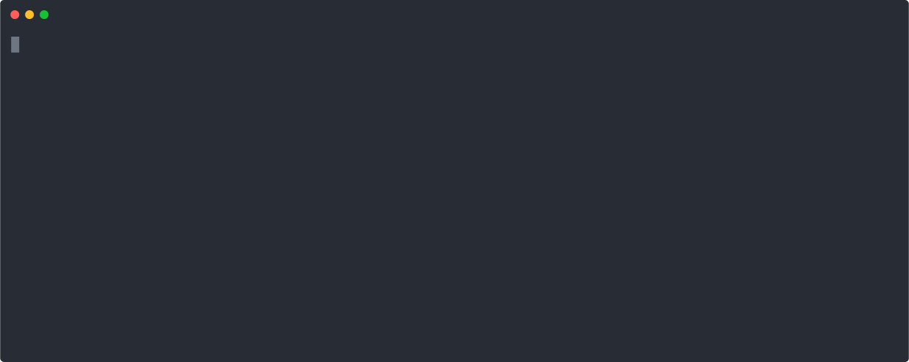

[](https://codeclimate.com/github/stoplightio/spectral/test_coverage)
[](https://codeclimate.com/github/stoplightio/spectral/maintainability)
[](https://dev.azure.com/vncz/vncz/_build/latest?definitionId=4&branchName=develop)
[](https://circleci.com/gh/stoplightio/spectral)

A flexible JSON linter with out of the box support for OpenAPI v2 and v3.



## Features

- Create custom rules to lint JSON or YAML objects
- Ready to use rules to validate and lint OpenAPI v2 _and_ v3 documents
- Use JSON path to apply rules to specific parts of your objects
- Built-in set of functions to help [create custom rules][add-rule]. Functions include pattern checks, parameter checks, alphabetical ordering, a specified number of characters, provided keys are present in an object, etc.
- Create custom functions for advanced use cases
- Validate JSON with [Ajv][ajv]

## Installation

```bash
npm install -g @stoplight/spectral

# OR

yarn global add @stoplight/spectral
```

For more installation options, see [Getting Started > Installation][install]

## Getting Started

After [installation][install] take a look at our [getting started documentation][get-started].

- [Adding a rule][add-rule]
- [Extending rulesets][extending-rulesets]
- [Enable only specific rules][enable-rule]
- [Disable specific rules][disable-rules]
- [Changing the severity of a rule][change-severity]
- [Using the JavaScript API][js-api]

## FAQs

### How is this different to AJV

[Ajv][ajv] is a JSON Schema validator, and Spectral is a JSON/YAML linter. Instead of just validating against JSON Schema, it can be used to write rules for any sort of JSON/YAML object, which could be JSON Schema, or OpenAPI, or anything similar. Spectral does expose a [`schema` function][ref-funcs] that you can use in your rules to validate all or part of the target object with JSON Schema (we even use Ajv used under the hood for this), but that's just one of many functions.

### I want to lint my OpenAPI documents but don't want to implement Spectral right now.

No problem! A hosted version of Spectral comes **free** with the Stoplight platform. Sign up for a free account [here](https://stoplight.io/?utm_source=github&utm_campaign=spectral).

### What is the difference between Spectral and Speccy

[Speccy](https://github.com/wework/speccy) was a great inspiration for Spectral, but was designed to work only with OpenAPI v3. Spectral can apply rules to _any_ JSON/YAML object (including OpenAPI v2 and v3) through the use of [JSONPath](http://goessner.net/articles/JsonPath/) `given` parameters. Some rule types have been enhanced to be a little more flexible along with being able to create your own rules based on the built-in functions, and we've added the ability to define custom functions too.

## Contributing

If you are interested in contributing to Spectral itself, check out our [contributing docs](CONTRIBUTING.md) to get started.

If you are using Spectral in your project and want to be listed in the examples section, we encourage you to open an [issue](https://github.com/stoplightio/spectral/issues).

### Example Implementations

- [Stoplight's Custom Style and Validation Rules](https://docs.stoplight.io/modeling/modeling-with-openapi/style-validation-rules) uses Spectral to validate and lint OpenAPI documents on the Stoplight platform
- [Spectral GitHub Bot](https://github.com/tbarn/spectral-bot), a GitHub pull request bot that lints your repo's OpenAPI document that uses the [Probot](https://probot.github.io) framework, built by [Taylor Barnett](https://github.com/tbarn)
- [Spectral GitHub Action](https://github.com/XVincentX/spectral-action), a GitHub Action that lints your repo's OpenAPI document, built by [Vincenzo Chianese](https://github.com/XVincentX/)

## Helpful Links

- [JSONPath Online Evaluator](http://jsonpath.com/), a helpful tool to determine what `given` path you want
- [stoplightio/json](https://github.com/stoplightio/json), a library of useful functions for when working with JSON
- [stoplightio/yaml](https://github.com/stoplightio/yaml), a library of useful functions for when working with YAML, including parsing YAML into JSON, and a few helper functions such as `getJsonPathForPosition` or `getLocationForJsonPath`

## Thanks :)

- [Phil Sturgeon](https://github.com/philsturgeon) for collaboration and creating Speccy
- [Mike Ralphson](https://github.com/MikeRalphson) for kicking off the Spectral CLI and his work on Speccy

## Support

If you have a bug or feature request, please [create an issue](https://github.com/stoplightio/spectral/issues).

If you need help using Spectral or have a support question, please use the [Stoplight Community forum](https://community.stoplight.io). We've created an open source category for these questions. It's also a great place to share your implementations.

If you want to discuss something in private, you can reach out to Stoplight support at [support@stoplight.io](mailto:support@stoplight.io).

[ajv]: https://www.npmjs.com/package/ajv
[get-started]: https://stoplight.io/p/docs/gh/stoplightio/spectral/docs/getting-started/concepts.md
[ref-funcs]: https://stoplight.io/p/docs/gh/stoplightio/spectral/docs/reference/functions.md
[add-rule]: https://stoplight.io/p/docs/gh/stoplightio/spectral/docs/getting-started/rulesets.md#adding-a-rule
[extending-rulesets]: https://stoplight.io/p/docs/gh/stoplightio/spectral/docs/getting-started/rulesets.md#extending-rules
[enable-rules]: https://stoplight.io/p/docs/gh/stoplightio/spectral/docs/getting-started/rulesets.md#enable-rules
[disable-rules]: https://stoplight.io/p/docs/gh/stoplightio/spectral/docs/getting-started/rulesets.md#disable-rules
[change-severity]: https://stoplight.io/p/docs/gh/stoplightio/spectral/docs/getting-started/rulesets.md#changing-severity-of-a-rule
[js-api]: https://stoplight.io/p/docs/gh/stoplightio/spectral/docs/guides/javascript.md
[install]: https://stoplight.io/p/docs/gh/stoplightio/spectral/docs/getting-started/installation.md