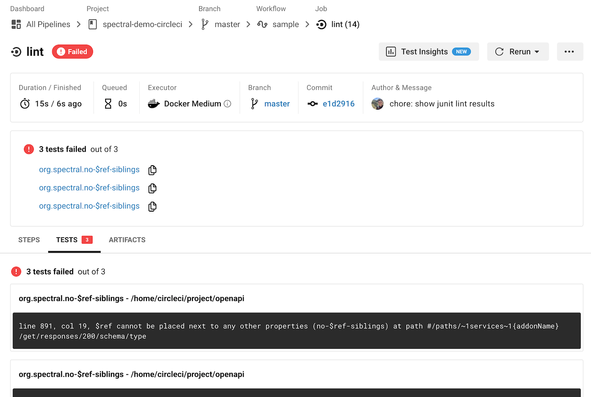

# Continuous Integration

## GitHub Action

Spectral has a pre-built [Spectral GitHub Action](https://github.com/stoplightio/spectral-action) which should speed up implementing Spectral in your GitHub repository.

## CircleCI

Users of CircleCI can take this entire file and save it as `.circleci/config.yml`, or move the `lint` job into their existing config.

```yaml
version: 2.1

orbs:
  node: circleci/node@4.1

jobs:
  lint:
    docker:
      - image: cimg/node:15.1
    steps:
      # Checkout the code as the first step.
      - checkout
      # Create a folder for results to live in
      - run: "[ -d lint-results ] || mkdir lint-results"
      - run:
          name: Run Spectral Lint
          command:
            npx @stoplight/spectral lint openapi.yaml
              -o lint-results/junit.xml
              -f junit
      - store_test_results:
          path: lint-results

workflows:
  sample:
    jobs:
      - lint
```

Change the `openapi.yaml` to point to whatever documents you want to lint, and use -f (format) to pick the JUnit output format. This is a standard test format that many CI servers understand, and means you should be able to see the errors in the Test interface.



Learn more about [CircleCI Configuration](https://circleci.com/docs/2.0/config-intro/), or take a look at this [demo repository](https://github.com/philsturgeon/spectral-demo-circleci).

## Jenkins

Instructions coming soon...
